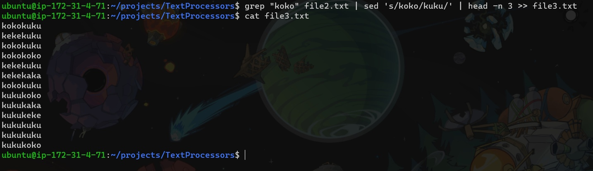

# TextProcessor
1. 40 последних строк из file1.txt в file2.txt

2. 10 первых строк из file2.txt в file3.txt

3. Выбрать в file2 все строки которые содержат "коко", заменить строку "коко" на "куку" и дописать только первые три вхождения в file3

4. Сортируем строки и оставляем только уникальные строки с их количеством 

